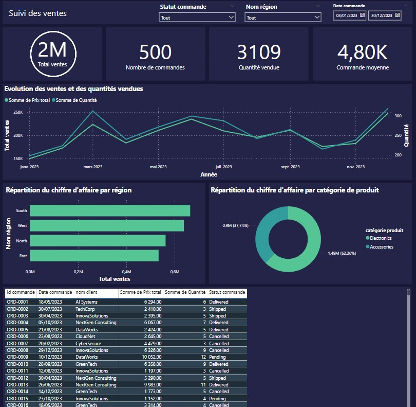
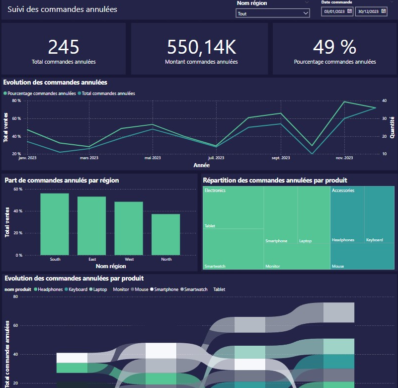
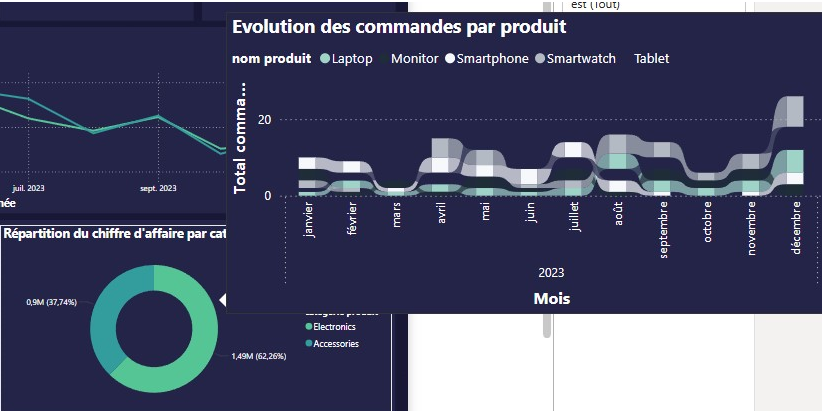
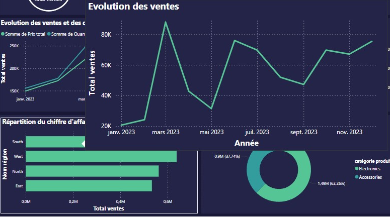

# 📊 Sales Performance Dashboard - Power BI

An interactive Power BI dashboard designed to transform raw sales data into actionable business insights through data modeling, DAX calculations, and effective visual storytelling.

## 🔹 Key Features
- Interactive sales performance analysis
- KPI tracking (Sales, Profit, Orders)
- Dynamic filters and drill-through
- Custom tooltips for deeper insights
- Product and regional performance analysis

## 🛠️ Skills Demonstrated
- Power BI
- Power Query
- DAX
- Data Modeling
- Data Visualization
- Dashboard Design
- Business Intelligence

## 📸 Dashboard Preview

### Sales Dashboard

### Cancelled Orders

### Product Tooltip

### Region Tooltip
# Sales-Performance-Dashboard-PowerBI
